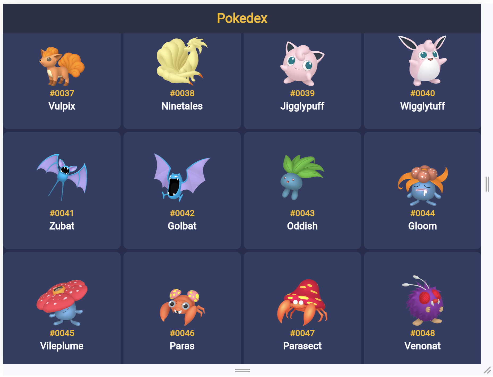

# Flutter Pokemon App

Welcome to the Flutter Pokemon App! This app is designed using clean architecture and follows the BLoC state management pattern. It is built to provide a user-friendly experience on all screen sizes, ensuring a responsive design.

## Features

- **List of Pokemon:** The app displays a list of Pokemon, initially loaded with a limit of 20. Users can load more Pokemon until the last one is reached.

- **Pokemon Details:** Users can view detailed information about each Pokemon, including their image, name, order, type, weight, height, and base stats.

- **Navigation:** Users can navigate to the previous and next Pokemon to explore the entire collection.

## Technologies Used

- **Flutter:** The app is developed using the Flutter framework for building natively compiled applications for mobile, web, and desktop from a single codebase.

- **Clean Architecture:** The project follows the clean architecture pattern to maintain separation of concerns and enhance maintainability.

- **BLoC State Management:** Business Logic Component (BLoC) is used for state management, providing a predictable and scalable way to manage the application's state.

## Screenshots

